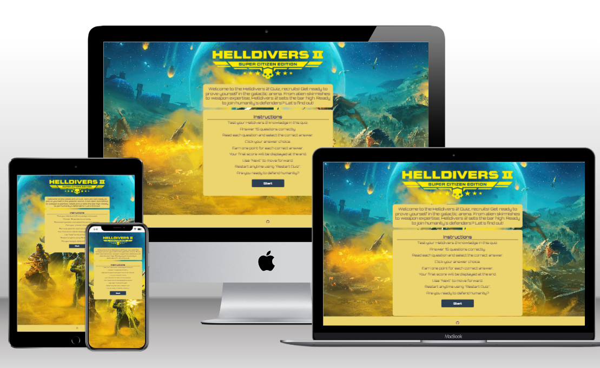
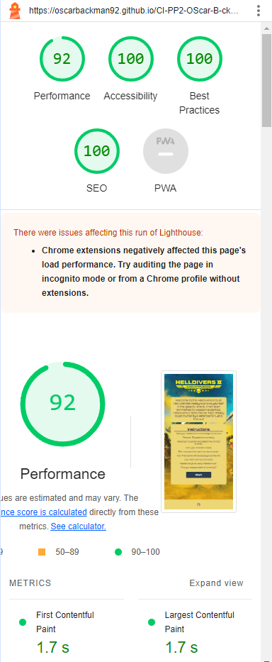
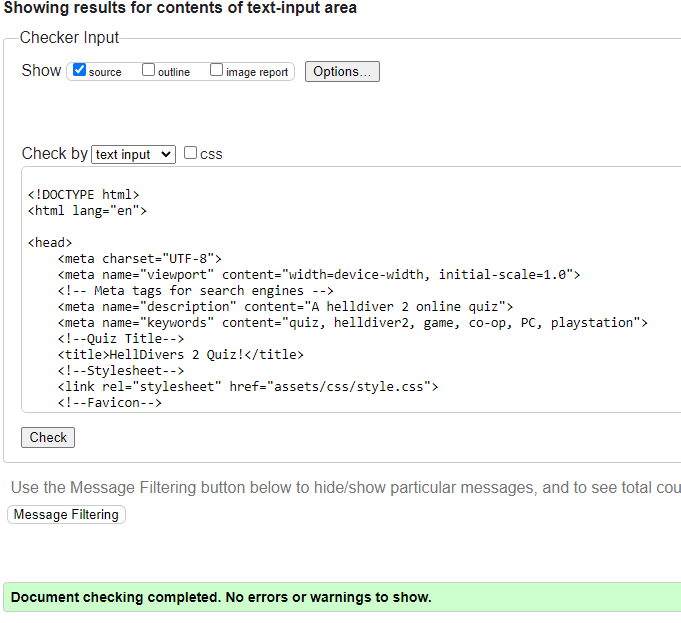
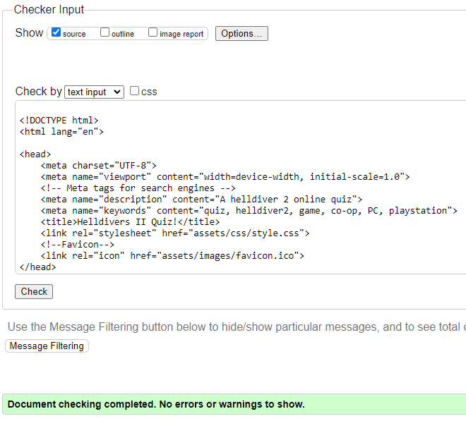
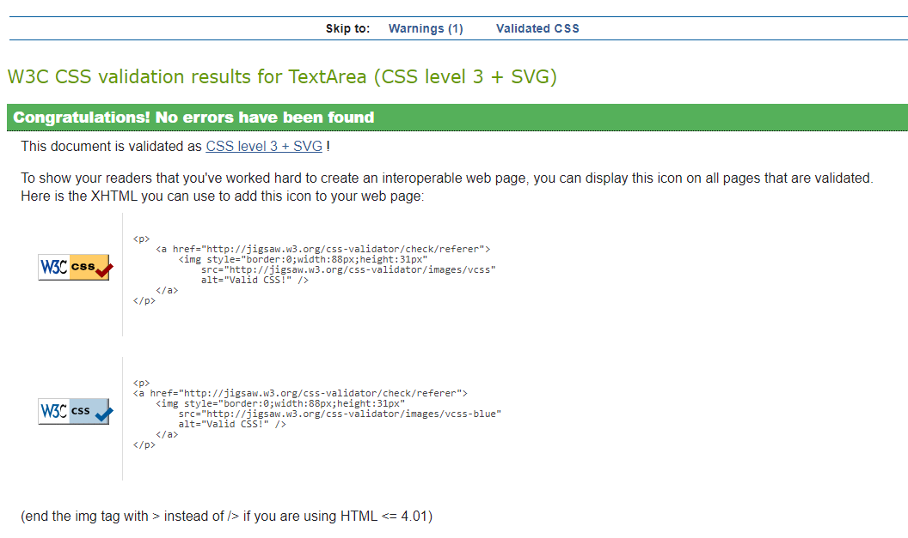
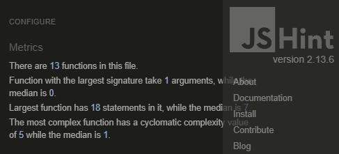

# Helldivers 2 Quiz


Welcome to my Helldivers 2 quiz!

## Introduction
This is a quiz about my new favorite game, Helldivers 2 by Arrowhead.

## Features

#### Favicon
* A favicon has been implemented with the helldiver 2 and can be seen in the nav for each page.
* This will allow the users to identify the website when they have multiple websites open.


## Quiz


## Technologies

* HTML
    * The structure of the Website was developed using HTML as the main language.
* CSS
    * The Website was styled using custom CSS in an external file.
* Gitpod
    * The site was developed with Gitpod IDE
* GitHub
    * Source code is hosted on GitHub and deployed using Git Pages.
* Git 
    * Used to commit and push code during the development opf the Website
* Font Awesome
    * Icons obtained from https://fontawesome.com/ were used as the Social media links in the footer section. 
* Favicon.io
    * favicon files were created at https://favicon.io/logo-generator/

## Testing

### Responsiveness

All pages have been tested to ensure responsiveness on screen from 320px to 1920px

Steps i went through for testing

1. Open browser and head over to https://oscarbackman92.github.io/CI-PP2-OScar-B-ckman/
2. Open Google devtools (right click inspect)
3. Set dimensions to responsive and width to 320px
4. Zoom 50%
5. Click and drag window edges to max width

Expected outcome:

The site is responsive on all screen sizes. Hero image not being pixelated/blurry
Some horizontal is present and that's the idea.

Result:

As expected. The website is responsive to screen sizes and images is working and elements is not compromised.

Tried the website on and Iphone 13 and Iphone 11 with no issues.

### Accessibility

[Wave Accessibility](https://wave.webaim.org/) tool was used in the later stages of development and for final testing of the deployed website to check for any aid accessibility testing.

Testing was focused on accessibility everyone

* All forms have associated labels or aria-labels so that this is read out on a screen reader to users who tab to form inputs
* That all headings have appropriate and meaningful content
* HTML page lang has been set
* Aria labels been implemented correctly and appropriately
* That there is an alt text to images on the website
* WCAG 2.1 Coding best practices being followed

### Lighthouse Testing



### Version Control

The site was created using the Visual Studio code editor and pushed to github to the remote repository ‘tacos-travels’.

The following git commands were used throughout development to push code to the remote repo:

```git add <file>``` - This command was used to add the file(s) to the staging area before they are committed.

```git commit -m “commit message”``` - This command was used to commit changes to the local repository queue ready for the final step.

```git push``` - This command was used to push all committed code to the remote repository on github.

### Validator

* HTML
  * No errors were returned when passing through the official [W3C validator](https://validator.w3.org)






* CSS
  * No errors were found when passing through the official [(Jigsaw) validator](https://jigsaw.w3.org)





### Functional Testing

| Test                | Steps                                    | Expected                                                      |
| ------------------- | ---------------------------------------- | ------------------------------------------------------------- |
| Start Game          | Click Start Game                         | The game starts and firstquestion is loaded                   |
| Select Answer       | Click an answer                          | The answer is highlighted                                     |
| Next question       | Click Next                               | The next question and answers is loaded                       |
| Select Wrong answer | Click a wrong answer                     | the wrong Answer get highlighted red and correct answer Green |
| Score               | Click next when last question is answerd | Shows score and array message                                 |
| Restart game        | Click restart quiz                       | First questions and answers is loaded 

## Deployment

### Deployment to Github Pages

* The site was deployed to GitHub pages. The steps to deploy are as follows: 
  * In the GitHub repository, navigate to the Settings tab 
  * From the menu on left select 'Pages'
  * From the source section drop-down menu, select the Branch: main
  * Click 'Save'
  * A live link will be displayed in a green banner when published successfully. 

The live link can be found here - https://oscarbackman92.github.io/CI-PP2-OScar-B-ckman/index.html

### Clone the Repository Code Locally

Navigate to the GitHub Repository you want to clone to use locally:

* Click on the code drop down button
* Click on HTTPS
* Copy the repository link to the clipboard
* Open your IDE of choice (git must be installed for the next steps)
* Type git clone copied-git-url into the IDE terminal

The project will now of been cloned on your local machine for use.


## Credits

- Jonathan_Zakrisson_Alumnus for debugging and structure tips.
- Daisy_mentor for just being plain awesome and helping me understand!
- Gareth McGirr for mentoring when Daisy is on vacation, really stepping up!
- CI for boilerplate and basic structure.
- Jennifer Hujanen for inspiration to quiz project.

### Content
- Text content was written by [Oscar Bäckman] and ChatGPT.

### Media
- Images and videos were sourced from [Image Source](https://www.theperfectloaf.com/my-best-sourdough-waffles/).

### Code
- HTML, CSS and JavaScript code were developed by [Oscar Bäckman] based on design requirements.
- CI for Boilerplate and structure.

### Focus Group
- Feedback and suggestions from focus group participants contributed to the refinement of the website design and features. None other than Oscar Bäckman and Josefine Bäckman.